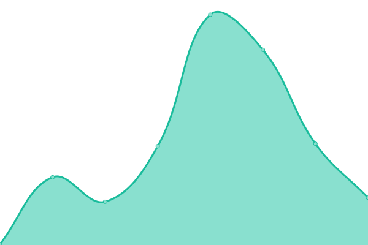
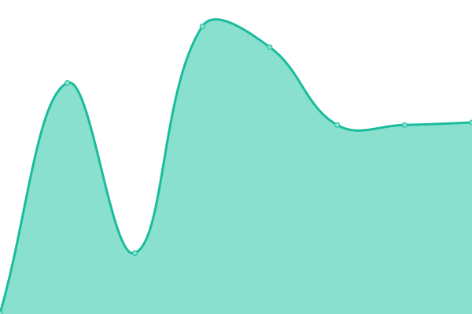
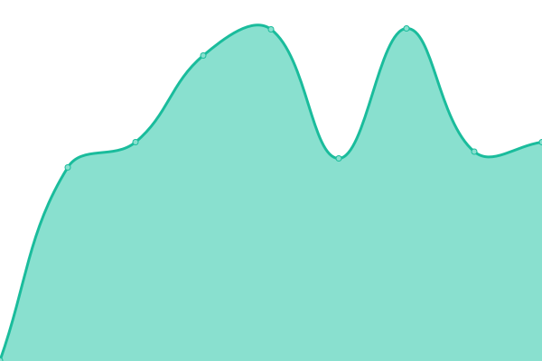

# [📈 Live Status](https://demo.upptime.js.org): <!--live status--> **🟧 Partial outage**

This repository contains the open-source uptime monitor and status page for [Upptime](https://upptime.js.org), powered by [Upptime](https://github.com/upptime/upptime).

With [Upptime](https://upptime.js.org), you can get your own unlimited and free uptime monitor and status page, powered entirely by a GitHub repository. We use [Issues](https://github.com/upptime/upptime/issues) as incident reports, [Actions](https://github.com/AmirKenzo/uptime/actions) as uptime monitors, and [Pages](https://demo.upptime.js.org) for the status page.

<!--start: status pages-->
<!-- This summary is generated by Upptime (https://github.com/upptime/upptime) -->
<!-- Do not edit this manually, your changes will be overwritten -->
<!-- prettier-ignore -->
| URL | Status | History | Response Time | Uptime |
| --- | ------ | ------- | ------------- | ------ |
|  [Google](https://www.google.com) | 🟩 Up | [google.yml](https://github.com/AmirKenzo/uptime/commits/HEAD/history/google.yml) | 

 186ms
     
 | 

<a href="https://AmirKenzo.github.io/uptime/history/google">99.83%</a>
    

|  [Cloudflare](https://cloudflare.com) | 🟩 Up | [cloudflare.yml](https://github.com/AmirKenzo/uptime/commits/HEAD/history/cloudflare.yml) | 

 392ms
     
 | 

<a href="https://AmirKenzo.github.io/uptime/history/cloudflare">100.00%</a>
    

|  [Wikipedia](https://en.wikipedia.org) | 🟩 Up | [wikipedia.yml](https://github.com/AmirKenzo/uptime/commits/HEAD/history/wikipedia.yml) | 

 197ms
     
 | 

<a href="https://AmirKenzo.github.io/uptime/history/wikipedia">100.00%</a>
    

|  [Hacker News](https://news.ycombinator.com) | 🟩 Up | [hacker-news.yml](https://github.com/AmirKenzo/uptime/commits/HEAD/history/hacker-news.yml) | 

 262ms
     
 | 

<a href="https://AmirKenzo.github.io/uptime/history/hacker-news">100.00%</a>
    

|  [SunRP](https://sunrp.ir) | 🟥 Down | [sun-rp.yml](https://github.com/AmirKenzo/uptime/commits/HEAD/history/sun-rp.yml) | 

 1944ms
     
 | 

<a href="https://AmirKenzo.github.io/uptime/history/sun-rp">98.23%</a>
    

|  [VMP](https://vmp.ir) | 🟥 Down | [vmp.yml](https://github.com/AmirKenzo/uptime/commits/HEAD/history/vmp.yml) | 

 6833ms
     
 | 

<a href="https://AmirKenzo.github.io/uptime/history/vmp">80.68%</a>
    

|  [Telegram](https://telegram.org) | 🟩 Up | [telegram.yml](https://github.com/AmirKenzo/uptime/commits/HEAD/history/telegram.yml) | 

 546ms
     
 | 

<a href="https://AmirKenzo.github.io/uptime/history/telegram">99.43%</a>
    

<!--end: status pages-->

[**Visit our status website →**](https://demo.upptime.js.org)

## 📄 License

- Powered by: [Upptime](https://github.com/upptime/upptime)
- Code: [MIT](./LICENSE) © [Anand Chowdhary](https://anandchowdhary.com), supported by [Pabio](https://pabio.com)
- Data in the `./history` directory: [Open Database License](https://opendatacommons.org/licenses/odbl/1-0/)
